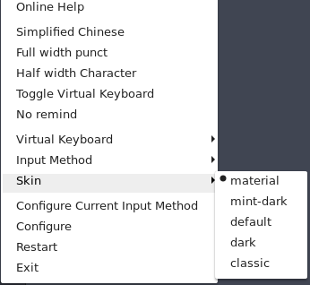
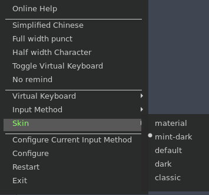

# fcitx-skin-collection
Collection of fcitx skin I like.

## skins
### material
Copy from github: [fcitx-skin-material](https://github.com/ootaharuki99/fcitx-skin-material).

The screenshot below shows how it looks:

### mint-dark
Copy from github: [Fcitx Linux Mint skin](https://github.com/fu-sen/fcitx-mint-skin.git).

The screenshot below shows how it looks:

## How To Install
Firstly, clone this repository, then copy all skins to your fcitx configuration path

	git clone https://github.com/gaunthan/fcitx-skin-collection.git
	mkdir ~/.config/fcitx/skin/ -p
	cp fcitx-skin-collection/skin/* ~/.config/fcitx/skin/ -r

Now you can right click *input keyboard* on system tray, and you will see `Skin` item.

Choose one :), and enjoy it.

